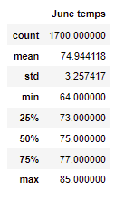
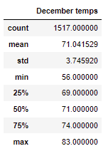

# surfs_up
## Overview of the statistical analysis:
The aim of the analysis is to provide information about temperature trends before opening the surf shop. for this reason, the months of June and December has beeen chosen to determine if the surf and ice cream shop business is sustainable year-round.

## Results

1) June has more observations than December, which means is more accurate.
2) June temperature is higher than December
3) June has a lower standard deviation than December, which implies that June temperature is more stable than December.

## Summary

In conclusion, it seems that the business will be sustainable year-round. According the results, the differences between these 2 months for the last six years are very low. On the other hand, as an extra information to gather data could be atmospheric pressure and clouds to know in advance the chance of getting storms or raining days that can affect the business operations. 
